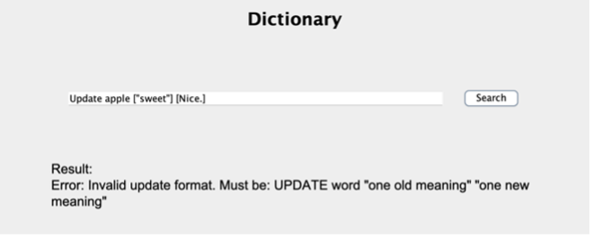
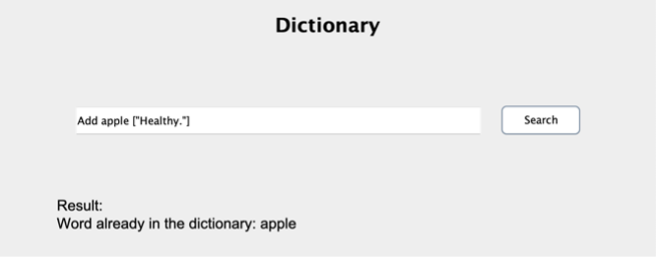
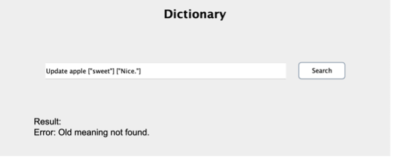
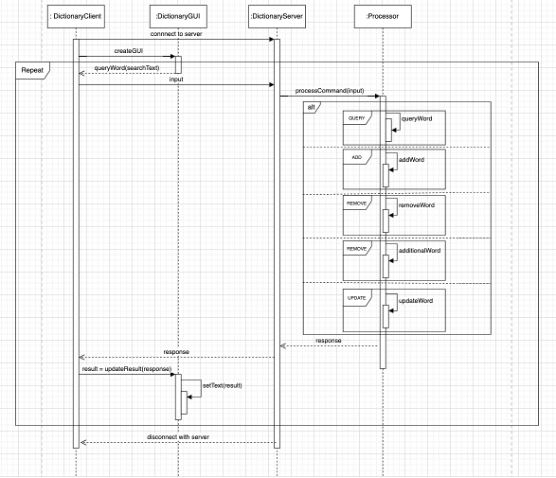

# Multi-threaded Dictionary System

---

## Introduction

The multi-threaded Dictionary is designed for users to search, add, and remove words efficiently.  
The system uses **Transmission Control Protocol (TCP)** for reliable communication between the client and the server and implements a **worker pool architecture** to manage threads.  
The worker pool improves performance by reducing the overhead of creating and destroying threads for each request.  
The dictionary also provides a **Graphical User Interface (GUI)** to make interactions more user-friendly.

---

## Architecture

The server implements a **worker pool architecture** with a pool of **10 worker threads** to handle incoming requests.  
This architecture helps manage high concurrency effectively while preventing thread exhaustion.  
Compared to models like thread-per-request or thread-per-connection, the worker pool minimizes thread creation and destruction overhead, leading to better resource utilization and improved performance.

---

## Communication Method

All communication between the client and the server is achieved through **TCP sockets**.  
TCP is chosen because it is a reliable and connection-oriented protocol that ensures data is transmitted correctly and without loss.  
Unlike UDP, TCP provides automatic error recovery, making it more suitable for a system where data integrity and reliability are crucial.

---

## Class Design

The system includes several key classes:

- **DictionaryClient**  
  Connects to the dictionary server, sends user inputs, and receives processed results.

- **DictionaryServer**  
  Runs the server, listens for incoming client connections, and handles multiple requests concurrently.

- **DictionaryGUI**  
  Provides the user interface, including a headline, input field, search button, results area, and instruction area.

- **Processor**  
  Handles all user input processing, updates the dictionary, and sends appropriate responses back to the client.

---

## Message Exchange Protocol

- **Starting the Server:**  
java –jar DictionaryServer.jar <port> <dictionary-file>

- **Starting the Client:**  
java –jar DictionaryClient.jar <server-address> <server-port>

- **Supported Commands:**
1. `QUERY word`: Search for the meaning of an existing word.
2. `ADD word [meaning]`: Add a new word with one or more meanings.
3. `REMOVE word`: Remove a word and its meanings.
4. `ADDITIONAL word [meaning]`: Add additional meanings to an existing word.
5. `UPDATE word [old meaning] [new meaning]`: Update an existing meaning of a word.

- **Why this format?**
1. **Easy to parse:** Consistent input format makes parsing reliable and reduces errors.
2. **User-Friendly:** Intuitive command structure with clear patterns for users.
3. **Notes:**  
   - If meanings include `" "`, users should replace with `' '`.  
   - If users don't use `[ ]` but meanings are inside `" "`, the input can still be parsed.

---

## Failure Model

The server is designed with robust error-handling mechanisms, including:

- **Network communication failures**  

- **Invalid input format**  

- **Duplicate word error**  

- **Word processing error**

Appropriate error messages are returned to the client to ensure system stability and user awareness.

---

## Supported Functions

1. **Query the meaning(s)**
 - Command: `QUERY word`
 - Example: `QUERY apple`
 - Returns error if the word is not found.

2. **Add a new word and meaning(s)**
 - Command: `ADD word [meaning]`
 - Example: `ADD grape ["purple fruit"]`
 - Multiple meanings example: `ADD grape ["purple fruit", "sweet"]`
 - Notes:
   - Without `[ ]`, meanings inside `" "` can still be parsed.
   - Error if the word already exists or input format is incorrect.

3. **Remove an existing word**
 - Command: `REMOVE word`
 - Example: `REMOVE apple`
 - Returns error if the word is not found.

4. **Add additional meaning(s) to an existing word**
 - Command: `ADDITIONAL word [meaning]`
 - Example: `ADDITIONAL apple ["red fruit"]`
 - Notes:
   - Same parsing rule for meanings without `[ ]` if inside `" "`.
   - Error if the word does not exist or input format is incorrect.

5. **Update existing meaning of a word**
 - Command: `UPDATE word [old meaning] [new meaning]`
 - Example: `UPDATE apple ["fruit"] ["red fruit"]`
 - Error if the word or old meaning does not exist.

---

## Data Persistence

**Note:** The system does **not implement data persistence**. All changes are valid only within the current session and are lost upon server restart.

**Reasons for this decision:**
1. **Security:**  
 Prevents malicious modification since multiple users share the system.

2. **Lack of reviewing system:**  
 No validation mechanism for user-submitted changes.

3. **Scalability Considerations:**  
 Persistence could be added later (e.g., using a database) without affecting current architecture.

---

## Interaction Diagram

*(Insert your diagram here, e.g., using Markdown image syntax: ``)*

---

## GUI Design

The GUI includes:
- Stretchable search bar adapting to window size.
- Clear result output (one line per meaning or instruction).
- Color-coded supported commands with examples and explanations for user clarity.

---

## Critical Analysis of the Work Done

- **Choice of Worker Pool Architecture:**  
Improves performance by minimizing thread creation/destruction overhead.

- **Future scalability and improvements:**  
Persistence could be added with security measures in the future.

- **Use of TCP:**  
Ensures reliable, error-free communication even though it may be slower than UDP.

- **GUI Design and Layout Choices:**  
Focused on clarity, adaptability, and user-friendliness.

- **Safe Concurrent Operations:**  
Achieved using `synchronized` and `ConcurrentHashMap` to protect shared resources and ensure thread safety.

---

## Summary

This project developed a **multi-threaded dictionary system** that allows users to search, add, remove, and modify words through a client-server architecture.  
It uses a **worker pool** for efficient concurrency, **TCP** for reliable communication, and a **user-friendly GUI** for better interactions.  
Although it currently does not support data persistence due to security concerns, the system is designed to be extendable for future improvements.

---
